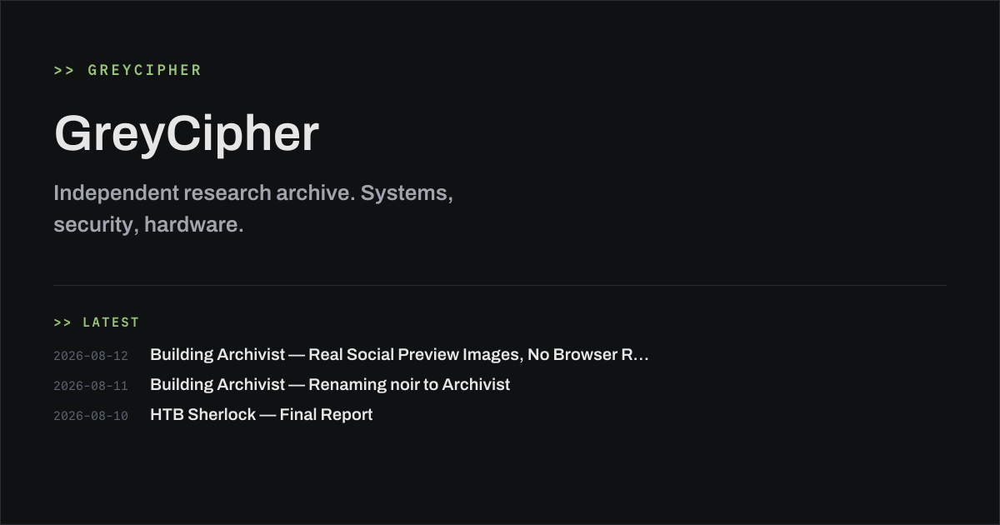

# NOIR

A minimal, dark, monospace-accented [Zola](https://www.getzola.org) theme for research notebooks, technical archives, and personal engineering blogs. No JavaScript, no tracking, no build step beyond Zola itself.



## Features

- Dark, high-contrast color scheme designed for long-form reading
- Six built-in content sections: **posts**, **projects**, **notes**, **ctf**, **wargames**, **about**
- Homepage digest showing latest posts, active projects, recent notes, recent CTF entries, and recent wargame logs
- Per-project metadata (stack, repository, license, status) via `extra`
- Tag and category taxonomies
- Built-in RSS 2.0 feed (`/rss.xml`)
- Pagination on all list sections
- SEO out of the box: dynamic meta descriptions, canonical URLs, Open Graph, Twitter Cards, JSON-LD structured data (see [SEO](#seo) below)
- Collections for multi-part series, ongoing projects, and investigative dossiers, any post in any section can opt in (see [Collections](#collections) below)
- No JavaScript, no external requests, no cookies
- Fully static, single CSS pass, self-hosted fonts

> Content is managed by hand exactly as you would with any other Zola site. A separate companion tool, `archivist`, is planned to automate the bookkeeping around Collections; see [Managing content](#managing-content) below.

## Installation

Inside your Zola site, add NOIR as a submodule (or plain clone) under `themes/`:

```bash
git submodule add https://github.com/GreyCipher-sec/NOIR.git themes/NOIR
```

Or without submodules:

```bash
git clone https://github.com/GreyCipher-sec/NOIR.git themes/NOIR
```

Then enable it in your site's `zola.toml`:

```toml
theme = "NOIR"
```

## Content structure

NOIR expects the following top-level sections in `content/`:

```
content/
├── about/
│   └── _index.md
├── posts/
│   ├── _index.md
│   └── my-post.md
├── projects/
│   ├── _index.md
│   └── my-project.md
├── notes/
│   ├── _index.md
│   └── my-note.md
├── ctf/
│   ├── _index.md
│   └── my-writeup.md
└── wargames/
    ├── _index.md
    └── my-level.md
```

Each `_index.md` needs a `template` pointing to the matching section template, e.g.:

```toml
+++
title = "Posts"
sort_by = "date"
template = "posts_section.html"
page_template = "page.html"
paginate_by = 10
+++
```

Repeat the same pattern for `projects/_index.md` (`projects_section.html`), `notes/_index.md` (`notes_section.html`), `ctf/_index.md` (`ctf_section.html`), and `wargames/_index.md` (`wargames_section.html`). `about/_index.md` uses `about_section.html` and just renders its own body, it has no child pages.

### Post / note front matter

```toml
+++
title = "Post title"
date = 2026-08-02T15:12:38+02:00
description = "Optional one-line summary, used in RSS."

[taxonomies]
categories = ["systems"]
tags = ["linux", "kernel"]
+++

Your content here.
```

### Project front matter

```toml
+++
title = "packet-loom"
date = 2026-08-02T16:09:17+02:00
description = "A minimal packet inspection toolkit for constrained hosts."

[extra]
status = "Active"
stack = "Rust, eBPF, libpcap"
repository = "https://github.com/you/packet-loom"
license = "MIT"
+++

Project write-up here.
```

### CTF write-up front matter

```toml
+++
title = "picoCTF 2026 - pwn/baby-rop"
date = 2026-08-05T10:00:00+02:00
description = "A basic ROP chain to bypass NX on a stripped x86_64 binary."

[taxonomies]
categories = ["pwn"]
tags = ["rop", "x86_64", "nx-bypass"]

[extra]
event = "picoCTF 2026"     # competition or CTF event name
category = "pwn"           # pwn / web / crypto / rev / forensics / misc
difficulty = "Easy"        # Easy / Medium / Hard / Insane
points = 100                # challenge point value, optional
solved = true                # shows a SOLVED / UNSOLVED badge on the listing page
+++

Write-up content here.
```

### Wargame log front matter

```toml
+++
title = "OverTheWire: Narnia - Level 4"
date = 2026-08-06T10:00:00+02:00
description = "Exploiting a format string vulnerability to overwrite a return address."

[taxonomies]
tags = ["format-string", "narnia"]

[extra]
platform = "OverTheWire - Narnia"   # wargame platform / series name
level = "4"                          # level, floor, or challenge number
difficulty = "Medium"                # Easy / Medium / Hard / Insane
+++

Write-up content here.
```

## Configuration

Minimal `zola.toml` for a site using NOIR:

```toml
base_url = "https://example.com"
title = "Your Site"
description = "Your tagline."
theme = "NOIR"

generate_feeds = true
feed_filenames = ["rss.xml"]

[[taxonomies]]
name = "tags"
feed = true
paginate_by = 10

[[taxonomies]]
name = "categories"
feed = true
paginate_by = 10

[extra]
author = "Your Name"
social_image = "images/social-preview.png"  # optional, used for Open Graph / Twitter previews
```

## SEO

NOIR ships with sensible SEO defaults so you don't have to think about it. All of this is generated automatically from your content and `zola.toml`, no extra setup required.

**On every page:**
- Unique `<title>` per page (`Post Title - Site Title`)
- `<meta name="description">` uses the page's `description` front matter, falls back to the auto-generated summary, then to the site description
- `<link rel="canonical">` prevents duplicate-content issues
- Open Graph tags (`og:title`, `og:description`, `og:type`, `og:image`, `og:url`) controls how links look when shared on Slack, Discord, etc.
- Twitter Card tags (switches to `summary_large_image` automatically if a social image is configured)
- `sitemap.xml` and `robots.txt` generated by Zola itself, no configuration needed

**On posts, projects, and notes specifically:**
- JSON-LD structured data (`schema.org/Article`) with publish date, author, and canonical URL, helps search engines understand your content without guessing
- Semantic `<time datetime="...">` for publish dates

**On the homepage:**
- JSON-LD `WebSite` block so search engines can identify the site

### Setting a default social preview image

To make shared links show a preview image instead of a blank card, add an image (1200×630px recommended) under `static/` and reference it in `zola.toml`:

```toml
[extra]
social_image = "images/social-preview.png"
```

### Writing good descriptions

Every `_index.md` and content page accepts a `description` field. Keep it under ~160 characters, that's roughly what shows up in Google search results and link previews:

```toml
+++
title = "Bypassing Signature Checks on Embedded Bootloaders"
date = 2026-08-02T15:12:38+02:00
description = "A walkthrough of a bootloader signature bypass on a common ARM SoC, and what it means for supply-chain trust."
+++
```

If you skip `description`, NOIR falls back to an auto-generated summary of the page content, then to the site-wide description in `zola.toml`, so nothing is ever left empty, but writing one by hand is worth the two minutes it takes.

## Collections

Some write-ups don't fit in a single post, a multi-part series, a long-running project, or a CTF/wargame dossier made of several linked entries. NOIR supports this without turning into a wiki or a CMS: any post in **any** section (posts, ctf, wargames, notes) can optionally belong to a collection, while continuing to behave like a completely normal, standalone article, it still shows up in its section listing, the homepage, RSS, tags/categories, and the sitemap exactly as before.

### Concepts

- **Collection** a themed group of entries: a `series` (linear, e.g. a tutorial), a `project` (open-ended, e.g. a tool that keeps evolving), a `dossier` (investigative/technical, e.g. a CTF case), or any other type you invent. Each collection is its own real, indexable page at `/collections/<id>/`.
- **Entry** a normal post that opts into a collection via two small front matter additions. It keeps its own URL, its own section, its own tags, the collection is a relationship, not a container.

This is deliberately built on Zola's native taxonomy system (the same mechanism behind `tags`/`categories`) rather than a bespoke system, so it stays static, git-versionable, and framework-native. It does **not** use Tera's list-manipulation filters (`concat`, `filter`, `map`) because this Zola build doesn't ship them, cross-section aggregation is instead handled by Zola's taxonomy engine itself, which is more robust anyway.

### How to create a new collection

Create one file: `content/collections/<id>.md`

```toml
+++
title = "HTB Sherlock"
date = 2026-08-01        # started
updated = 2026-08-11      # last updated - bump this whenever you add an entry

[extra]
collection_type = "dossier"   # series | project | dossier | anything you want
status = "active"              # planned | active | paused | completed | archived
+++

Optional longer intro shown at the top of the collection page.
```

`<id>` must be lowercase-hyphenated (e.g. `htb-sherlock`) it's used as-is to link entries to this collection, so keep it consistent.

The `status` field controls what the position indicator shows on entry pages: `completed`/`archived` collections show a fixed total (`3 / 5`); anything else shows an open-ended total (`3 / ?`), since more entries might still be coming.

### How to add a post to a collection

In any post, in **any** section, add:

```toml
[taxonomies]
collection = ["htb-sherlock"]   # must match the collection's <id> exactly

[extra]
collection_part = 3              # required - controls ordering within the collection
```

That's it. The entry automatically appears on the collection page, in the right position, with working Previous/Next navigation, no manual index to update, no total to maintain.

**`collection_part` is required for every entry in a collection.** Templates sort and link entries by this value, so a missing `collection_part` on an entry that has a `collection` taxonomy will break template rendering at `zola build` time, Zola will fail with an error pointing at the offending page, since the field the template expects isn't there. This is Zola's own behavior, not a feature NOIR adds on top; today, nothing checks for this *before* you run the build. See [Managing content](#managing-content) for a planned tool that would catch this earlier, with a clearer message.

Standalone posts (no `[taxonomies] collection`) are entirely unaffected and need no `collection_part`.

Numbering can have gaps (`1, 2, 4, 5`), the system only sorts by whatever values exist, it doesn't require consecutive numbers or a known final count.

### How the navigation works

Any post with a `collection` taxonomy automatically gets, with zero extra template work:

- An eyebrow line above the title: `SERIES / BUILDING A CLI IN RUST · 3 / 5`, linking to the collection page
- A contextual nav block at the end of the article: `← Previous entry`, `↑ Collection`, `→ Next entry` omitting Previous on the first entry and Next on the last, and never appearing at all on standalone posts

Both are computed at build time from `collection_part`, not from publish date, so you can write and correct entries out of order without breaking the sequence.

### How to create a standalone post

Nothing to do, just don't add a `collection` taxonomy. Every post is standalone by default; collections are opt-in.

## Managing content

Everything above, creating files, filling in front matter, bumping `updated` on a collection, running `zola build`/`zola serve`, is done by hand today, the same way as on any other Zola site. There is no bundled tooling in this repository.

### Planned: `archivist`

`archivist` is a separate CLI/TUI tool, **currently in early/embryonic development, not yet released**, intended to live in its own repository and automate the bookkeeping this theme's Collections feature involves: auto-numbering `collection_part`, bumping a collection's `updated` date, validating the content tree before a build (catching a missing `collection_part`, a `collection` id that doesn't match any collection file, duplicate part numbers, etc.), and optionally driving `zola build`/`zola serve` with output streamed into the tool.

## Templates

| Template | Purpose |
|---|---|
| `base.html` | Shell: header, nav, footer, shared styles |
| `index.html` | Homepage, latest posts, active projects, recent notes |
| `page.html` | Single post / project / note page |
| `posts_section.html` | Posts listing with pagination |
| `projects_section.html` | Project dossiers listing with pagination |
| `notes_section.html` | Notes grid with pagination |
| `ctf_section.html` | CTF write-ups listing,  shows event, category, difficulty, points, solved/unsolved badge |
| `wargames_section.html` | Wargame logs listing, shows platform, level, difficulty |
| `collections_section.html` | Index of all series/projects/dossiers |
| `collection_single.html` | Single collection reference page,  status, entry count, ordered entry list |
| `about_section.html` | Renders the About page body |
| `taxonomy_list.html` | Index of tags or categories |
| `taxonomy_single.html` | Pages under one tag/category |
| `404.html` | Not found page |
| `rss.xml` | Custom RSS 2.0 feed (overrides Zola's default Atom feed) |

## Local development

This repository is itself a working Zola site used to preview the theme. It contains a self-referencing symlink so you can develop and preview NOIR without a separate demo site, already included in this repo (`themes/NOIR`, pointing at the repository root):

```bash
zola serve
```

If you're setting it up from scratch elsewhere (or the symlink didn't survive a zip/copy, see note below), recreate it from the repository root with:

```bash
mkdir -p themes && ln -s .. themes/NOIR
```

`content/`, `static/`, `templates/` at the repository root **are** the theme; `zola.toml` and `content/` at the root are only used for local preview and are not required by sites consuming the theme.

## License

MIT - see `LICENSE`.

## Credits

Design and layout by GreyCipher.
